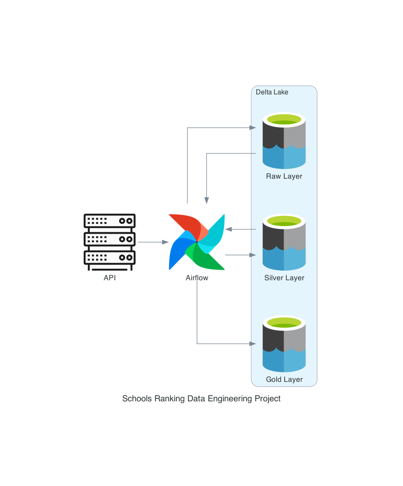

# Schools Ranking Data Engineering Project

The goal of this project was to create a data pipeline that will allow us to rank schools based on their rating. 
Data sourced is [Attom](https://api.developer.attomdata.com/home) API that allows us to search for schools based on geocode.
The geocode used in this example solution is Michigan	state, but it can be easily configured to be any other state. 
The data is cleaned and transformed using a Python Pandas library, and is stored in Azure Data Lake. DAG is created using Airflow.

 
## Overview

### Dataset used
The Dataset used in this project is [Attom](https://api.developer.attomdata.com/home) API
that allows us to search for schools based on geocode.
Exact endpoint used is [property school search](https://api.developer.attomdata.com/docs#!/School32V4/propertySchoolSearch). 
The API provides a lot of information about schools, like location, url, rating, address, school type, etc.
The data is returned in JSON format.

### Data Pipeline
The data pipeline is created using Airflow. 
The DAG is created in [`schools_dag.py`](schools_dag.py) file, and the tasks are defined in [`schools_etl_parts.py`](schools_etl_parts.py) file.
It is scheduled to run every week, and has no stop date.
The pipeline consists of the following steps:
1. Extract data from API (`download_raw_data` task)
   - In this step we extract data from API, and save it in JSON format in `raw-data` folder, adding to file name the execution date of the DAG.
   - For this task we are using method `download_raw_data` from [`schools_etl_parts.py`](schools_etl_parts.py) file
2. Save raw data to Azure Data Lake (`save_raw_data_to_azure_data_lake` task)
   - In this step we upload the raw data JSON file that we saved on disk to Azure Data Lake, into `raw-data` container.
   - For this task we are using method `upload_file_to_azure_data_lake` from [`schools_etl_parts.py`](schools_etl_parts.py) file, that is generic method that can be used to upload any file to Azure Data Lake.
3. Process raw data to silver
    - In this step we process the raw data, and save it in CSV format in `silver-data` folder, adding to file name the execution date of the DAG.
    - Here we just extract few columns from the raw data that could be used to do more than one interesting analysis.
    - We also save transformed DF to CSV file, so that we can easily load it to Azure Data Lake in the next step.
    - For this task we are using method `process_raw_data_to_silver` from [`schools_etl_parts.py`](schools_etl_parts.py) file.
4. Save silver data to Azure Data Lake (`save_silver_data_to_azure_data_lake` task)
   - In this step we upload the silver data CSV file that we saved on disk to Azure Data Lake, into `silver-data` container.
   - For this task we are once again using method `upload_file_to_azure_data_lake` from [`schools_etl_parts.py`](schools_etl_parts.py).
5. Transform silver data (`transform_silver_data` task)
   - In this step we transform the silver data, and save it in CSV format in `gold-data` folder, adding to file name the execution date of the DAG.
   - Here we are mapping school rating from A-F scale to a number scale, so that we can use this column to extract means of rating for schools in one district.
   - Then we do cleaning, we are removing any rows with NA values, for school rating.
   - We are casting all columns to correct data types.
   - Finally, we can group by `school_district_name` column, calculate mean of `school_rating` column, and round means to integer.
   - As a last step, we have to reverse mapping that we're done at the beginning, so that we can have rating in A-F scale again.
   - For this task we are using method `transform_silver_data` from [`schools_etl_parts.py`](schools_etl_parts.py) file.
6. Save gold data to Azure Data Lake (`save_gold_data_to_azure_data_lake` task)
   - In this step we upload the gold data CSV file that we saved on disk to Azure Data Lake, into `gold-data` container.
   - For this task we are once again using method `upload_file_to_azure_data_lake` from [`schools_etl_parts.py`](schools_etl_parts.py).

### Data Architecture
The data architecture used in this project is shown in the diagram below.

We mainly use Azure Data Lake to store our data, and we use Airflow to orchestrate our data pipeline.
Selection of technologies is based purely on the fact that I wish to learn more about Airflow, and Azure Data Lake, and this project was a great opportunity to do so.

### What can the data be used for?
The data can be used to rank schools based on their rating,
and to compare school districts based on their average rating.
It can be used to create a map of schools in a district, and to show their rating.

## Lessons Learned
I learned how to use Airflow to create a data pipeline, and orchestrate it.

## Contact
Please feel free to contact me if you have any questions via [my portfolio page](https://lczerniawski.github.io)